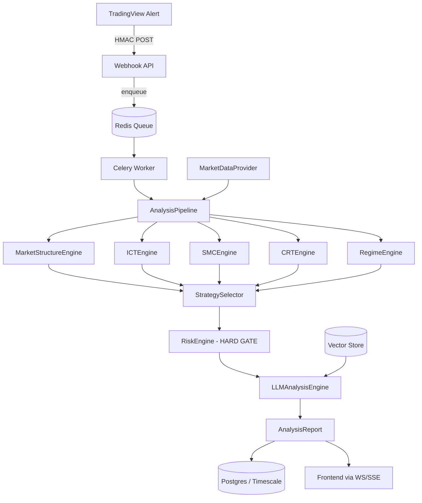
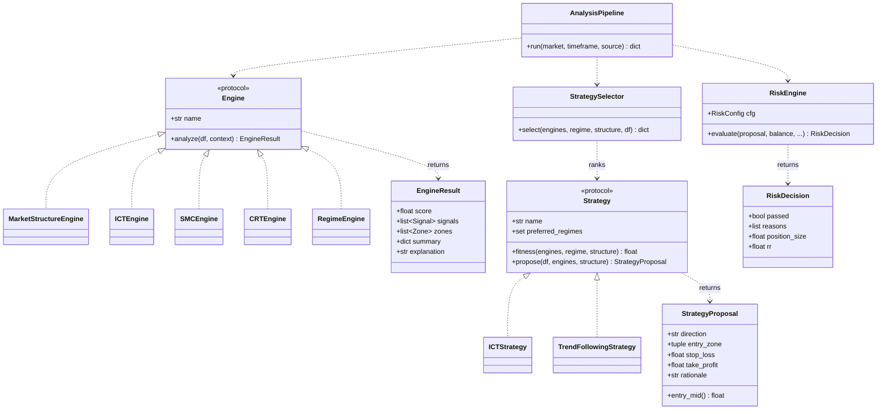
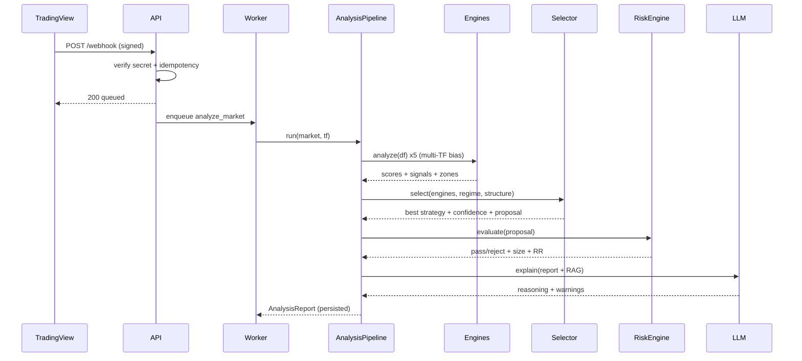

# TradingGPT — Architecture & Class Diagrams

## Component / data flow

```mermaid
flowchart TD
    TV[TradingView Alert] -->|HMAC POST| WH[Webhook API]
    WH -->|enqueue| Q[(Redis Queue)]
    Q --> W[Celery Worker]
    W --> P[AnalysisPipeline]
    MD[MarketDataProvider] --> P
    P --> MS[MarketStructureEngine]
    P --> ICT[ICTEngine]
    P --> SMC[SMCEngine]
    P --> CRT[CRTEngine]
    P --> RG[RegimeEngine]
    MS & ICT & SMC & CRT & RG --> SEL[StrategySelector]
    SEL --> RISK[RiskEngine - HARD GATE]
    RISK --> LLM[LLMAnalysisEngine]
    RAG[(Vector Store)] --> LLM
    LLM --> REP[AnalysisReport]
    REP --> DB[(Postgres / Timescale)]
    REP --> FE[Frontend via WS/SSE]
```

## Class diagram (core domain + engines)

```mermaid
classDiagram
    class Engine {
        <<protocol>>
        +str name
        +analyze(df, context) EngineResult
    }
    class EngineResult {
        +float score
        +list~Signal~ signals
        +list~Zone~ zones
        +dict summary
        +str explanation
    }
    class Strategy {
        <<protocol>>
        +str name
        +set preferred_regimes
        +fitness(engines, regime, structure) float
        +propose(df, engines, structure) StrategyProposal
    }
    class StrategyProposal {
        +str direction
        +tuple entry_zone
        +float stop_loss
        +float take_profit
        +str rationale
        +entry_mid() float
    }
    class RiskEngine {
        +RiskConfig cfg
        +evaluate(proposal, balance, ...) RiskDecision
    }
    class RiskDecision {
        +bool passed
        +list reasons
        +float position_size
        +float rr
    }
    class StrategySelector {
        +select(engines, regime, structure, df) dict
    }
    class AnalysisPipeline {
        +run(market, timeframe, source) dict
    }

    Engine <|.. MarketStructureEngine
    Engine <|.. ICTEngine
    Engine <|.. SMCEngine
    Engine <|.. CRTEngine
    Engine <|.. RegimeEngine
    Engine ..> EngineResult : returns
    Strategy <|.. ICTStrategy
    Strategy <|.. TrendFollowingStrategy
    Strategy ..> StrategyProposal : returns
    StrategySelector ..> Strategy : ranks
    RiskEngine ..> RiskDecision : returns
    AnalysisPipeline ..> Engine
    AnalysisPipeline ..> StrategySelector
    AnalysisPipeline ..> RiskEngine
```

## Sequence (one analysis)

```mermaid
sequenceDiagram
    participant TV as TradingView
    participant API
    participant W as Worker
    participant Pipe as AnalysisPipeline
    participant Eng as Engines
    participant Sel as Selector
    participant Risk as RiskEngine
    participant LLM
    TV->>API: POST /webhook (signed)
    API->>API: verify secret + idempotency
    API-->>TV: 200 queued
    API->>W: enqueue analyze_market
    W->>Pipe: run(market, tf)
    Pipe->>Eng: analyze(df) x5 (multi-TF bias)
    Eng-->>Pipe: scores + signals + zones
    Pipe->>Sel: select(engines, regime, structure)
    Sel-->>Pipe: best strategy + confidence + proposal
    Pipe->>Risk: evaluate(proposal)
    Risk-->>Pipe: pass/reject + size + RR
    Pipe->>LLM: explain(report + RAG)
    LLM-->>Pipe: reasoning + warnings
    Pipe-->>W: AnalysisReport (persisted)
```
